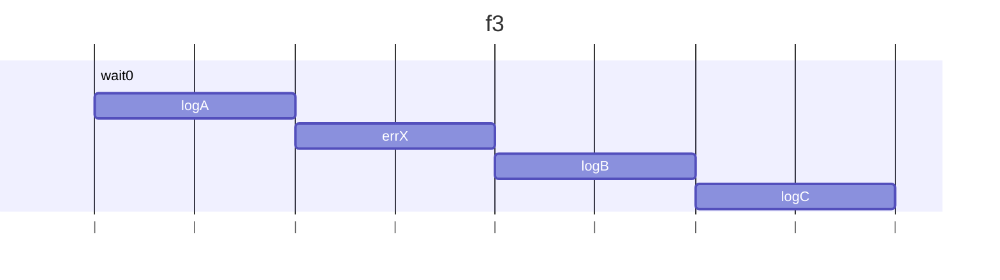

```mermaid
gantt
  title f3
  dateFormat  s
  axisFormat |
    wait0 :w0, 0, 0s
    logA  :l1, after w0, 0.2s
    errX  :e1, after l1, 0.2s
    logB  :l2, after e1, 0.2s
    logC  :l3, after l2, 0.2s
```