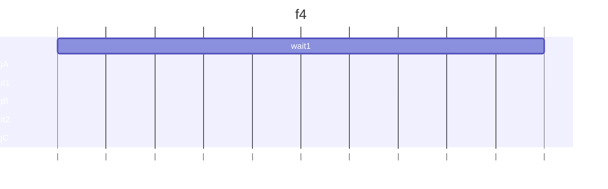

```mermaid
gantt
  title f4
  dateFormat  s
  axisFormat |
    wait1 :w1, 0, 1s
    logA  :l1, after w1, 0.2s
    wait1 :w1, after l1, 1s
    logB  :l2, after w1, 0.2s
    wait2 :w2, after w1, 2s
    logC  :l3, after w2, 0.2s
```