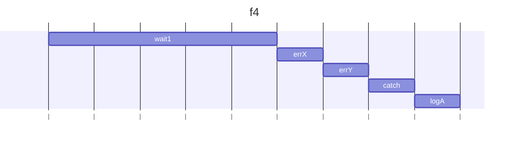

```mermaid
gantt
  title f4
  dateFormat  s
  axisFormat |
    wait1 :w1, 0, 1s
    errX :eX, after w1, 0.2s
    errY :eY, after eX, 0.2s
    catch :ch, after eY, 0.2s
    logA  :l1, after ch, 0.2s
```