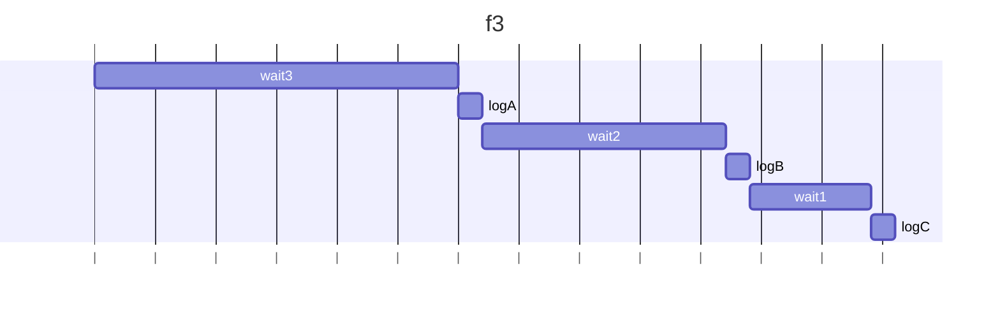

```mermaid
gantt
  title f3
  dateFormat  s
  axisFormat |
    wait3 :w3, 0, 3.0s
    logA  :l1, after w3, 0.2s
    wait2  :w2, after l1, 2.0s
    logB  :l2, after w2, 0.2s
    wait1 :w1, after l2, 1.0s 
    logC  :l3, after w1, 0.2s
```