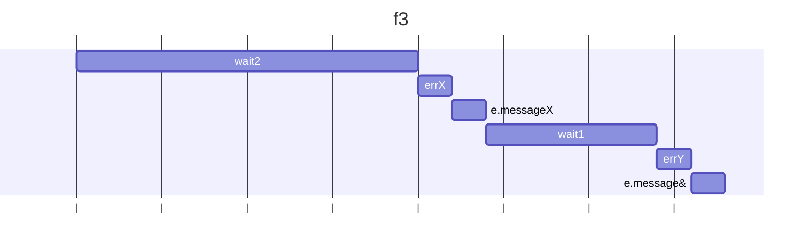

```mermaid
gantt
  title f3
  dateFormat  s
  axisFormat |
    wait2 :w2, 0, 2.0s
    errX  :eX, after w2, 0.2s
    e.messageX :emX, after eX , 0.2s
    wait1  :w1, after emX, 1.0s
    errY  :eY, after w1, 0.2s
    e.message& :emY, after eY, 0.2s 
```