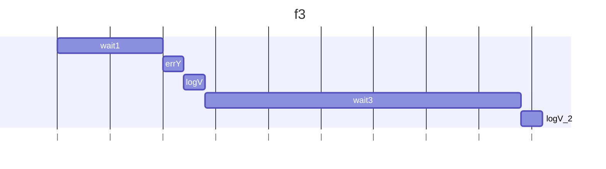

```mermaid
gantt
  title f3
  dateFormat  s
  axisFormat |
    wait1 :w1, 0, 1s
    errY  :eY, after w1, 0.2s
    logV  :lV, after eY, 0.2s
    wait3  :w3, after lV, 3s
    logV_2  :lV_2, after w3, 0.2s
```