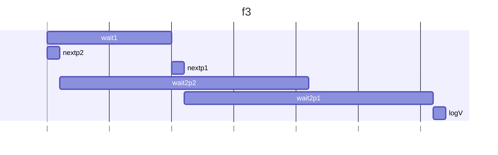

```mermaid
gantt
  title f3
  dateFormat  s
  axisFormat |
    wait1 :w1, 0, 1s
    nextp2 :np2, 0, 0.1s
    nextp1 :np1, after w1, 0.1s
    wait2p2  :w2p2, after np2, 2.0s
    wait2p1 :w2p1, after np1, 2.0s
    logV    :lV, after w2p1, 0.1s
```